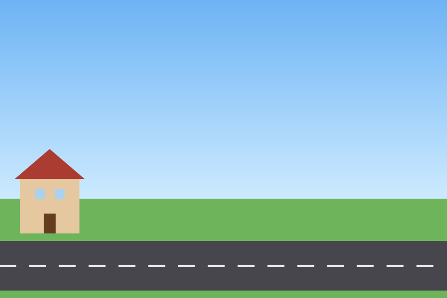
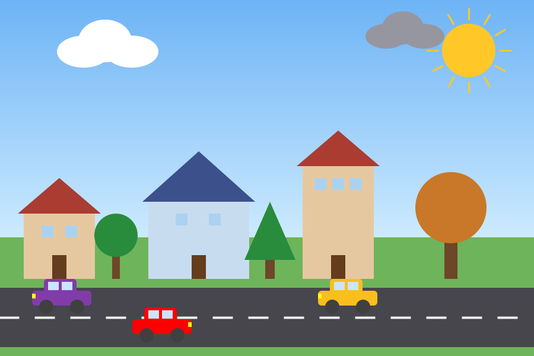

# Mahalle Laboratuvarı — Nesneleri Oluştur, Mahalleyi Kur

Bu etkinlikte hazır sınıflardan **nesneler oluşturacak**, nesnelere **değer verecek** ve nesnelerin **metotlarını çağıracaksınız**. Her görevi bitirdiğinizde mahallenize yeni bir şey eklenecek.

| Başlangıçta | Bütün görevler bitince |
| --- | --- |
|  |  |

---

## Yapacağınız üç şey

| İşlem | Nasıl yazılır? | Örnek |
| --- | --- | --- |
| Nesne oluşturmak | `SinifAdi nesneAdi = new SinifAdi();` | `Ev ev1 = new Ev();` |
| Nesnenin özelliğine değer vermek | `nesneAdi.ozellik = deger;` | `ev1.x = 250;` |
| Nesnenin metodunu çağırmak | `nesneAdi.metot();` | `ev1.katEkle();` |

Oluşturduğunuz nesnenin ekranda görünmesi için onu listeye eklersiniz: `evler.add(ev1);`

---

## Kurallar

- **Yapay zekâ araçları kullanılmaz.** Takılırsanız bu dosyadaki tablolara, `Sahne.java` içindeki örneğe, grup arkadaşlarınıza ya da öğretmeninize bakın.
- Yalnızca **`Sahne.java`** dosyasındaki `GÖREV` yazan yerleri dolduracaksınız.
- Diğer dosyalar hazır. Onları açıp okuyabilirsiniz ama değiştirmeyin.

---

## Nasıl çalıştırılır?

**IDE ile (VS Code, IntelliJ, NetBeans, Eclipse):** `src` klasöründeki **`Main.java`** dosyasını açın ve çalıştırın. Başka bir dosyayı çalıştırırsanız “Main method not found” hatası alırsınız.

**Terminalle:**

```
cd src
javac -encoding UTF-8 *.java
java Main
```

Her görevi bitirdikten sonra dosyayı kaydedin, programı **kapatıp yeniden çalıştırın** ve neyin değiştiğine bakın.

---

## Grupla çalışma

Görevlerin hepsi aynı dosyada olduğu için grup tek bilgisayarda çalışır. **Her görevde klavyedeki kişi değişir**, diğerleri yardım eder. Herkes en az iki görev yazmış olmalı.

---

## Sınıflar: hangi özellikler ve metotlar var?

Bu tablolar size hangi değerleri verebileceğinizi ve hangi metotları çağırabileceğinizi gösterir. Değer vermediğiniz özellikler tablodaki hazır değerle kalır.

### Ev

| Özellik | Tür | Hazır değer | Anlamı |
| --- | --- | --- | --- |
| `x` | int | 0 | Evin sol kenarı |
| `y` | int | 470 | Evin zemine oturduğu çizgi |
| `genislik` | int | 120 | |
| `yukseklik` | int | 110 | |
| `pencereSayisi` | int | 2 | |
| `duvarRengi` | Color | açık kahve | |
| `catiRengi` | Color | kırmızı | |
| `isikAcik` | boolean | false | Pencerelerin ışığı |

| Metot | Ne yapar? |
| --- | --- |
| `katEkle()` | Evi bir kat (40 piksel) yükseltir. |
| `isikDegistir()` | Işık açıksa kapatır, kapalıysa açar. |

### Agac

| Özellik | Tür | Hazır değer | Anlamı |
| --- | --- | --- | --- |
| `x` | int | 0 | Gövdenin ortası |
| `y` | int | 470 | Ağacın zemine oturduğu çizgi |
| `boy` | int | 110 | |
| `tur` | String | `"yuvarlak"` | `"yuvarlak"` ya da `"cam"` |
| `yaprakRengi` | Color | yeşil | |

| Metot | Ne yapar? |
| --- | --- |
| `buyu()` | Ağacı 10 piksel büyütür (en fazla 220). |

### Araba

| Özellik | Tür | Hazır değer | Anlamı |
| --- | --- | --- | --- |
| `x` | int | 0 | Arabanın sol kenarı |
| `y` | int | alt şerit | Üst şerit için `SahnePaneli.UST_SERIT` |
| `renk` | Color | kırmızı | |
| `hiz` | int | 3 | 1 ile 12 arası |
| `sagaGidiyor` | boolean | true | |

| Metot | Ne yapar? |
| --- | --- |
| `hizlan()` | Hızı 1 artırır (en fazla 12). |
| `yonDegistir()` | Arabayı ters yöne çevirir. |

### Bulut

| Özellik | Tür | Hazır değer | Anlamı |
| --- | --- | --- | --- |
| `x` | double | 0 | Bulutun sol kenarı |
| `y` | int | 60 | Bulutun yüksekliği (küçükse daha yukarıda) |
| `boyut` | int | 90 | |
| `hiz` | double | 0.4 | |
| `yagmurlu` | boolean | false | true ise bulut gri olur |

### Gunes

| Özellik | Tür | Hazır değer | Anlamı |
| --- | --- | --- | --- |
| `x`, `y` | int | 0, 0 | Güneşin merkezi |
| `yaricap` | int | 45 | |

| Metot | Ne yapar? |
| --- | --- |
| `geceGunduzDegistir()` | Güneşi aya, ayı güneşe çevirir. |

### Renkler

Renk vermek için `Color.RED`, `Color.BLUE`, `Color.GREEN`, `Color.YELLOW`, `Color.ORANGE`, `Color.PINK`, `Color.WHITE` gibi hazır renkleri ya da `new Color(kırmızı, yeşil, mavi)` yazımını kullanabilirsiniz. Üç sayı 0 ile 255 arasında olmalıdır.

### Ekranın koordinatları

Sol üst köşe (0, 0)'dır. **x sağa doğru, y aşağı doğru artar.** Ekran 900 piksel genişliğinde, 600 piksel yüksekliğindedir. Gökyüzü y = 400'de biter.

---

## Görevler ve doğru yaptım mı?

| Görev | Ne yapacaksınız? | Doğruysa ekranda ne olur? |
| --- | --- | --- |
| 1 | Güneşi oluşturup sağ üste taşımak | Sağ üstte güneş görünür. |
| 2 | Mavi evi oluşturmak | Ortada mavi çatılı geniş bir ev görünür. |
| 3 | Apartmanı oluşturup iki kat eklemek | Sağda üç pencereli uzun bir ev görünür. |
| 4 | Yuvarlak ağaç | İlk evin sağında bir ağaç görünür. |
| 5 | Çam ağacı | Mavi evin sağında üçgen bir ağaç görünür. |
| 6 | Kırmızı araba | Alt şeritte sağa giden kırmızı araba görünür. |
| 7 | Sarı araba | Üst şeritte sola giden sarı araba görünür. |
| 8 | İki bulut | Beyaz bir bulut ve gri bir yağmur bulutu görünür. |
| 9 | Grubunuzun arabası ve ağacı | Sizin seçtiğiniz renkte bir araba ve bir ağaç görünür. |
| 10 | Tıklayınca ağaç | Çimene tıklayınca oraya yeni bir ağaç çıkar. |
| 11 | H tuşu | H tuşuna basınca arabalar hızlanır. |
| 12 | B tuşu | B tuşuna basınca ağaçlar büyür. |
| 13 | G tuşu | G tuşuna basınca gece olur, evlerin ışıkları yanar, güneş aya döner. |

**Y** tuşu baştan hazır: arabaların yönünü değiştirir. Görev 11–13'te onun nasıl yazıldığına bakın.

---

## Bitirince

1. Bütün görevler bitmiş ve program hatasız çalışıyor olmalı.
2. **G** tuşuyla gece moduna geçin ve sahnenizin ekran görüntüsünü alın.
3. Ekran görüntüsünü öğretmeninize gösterin ya da gönderin.

---

## Takıldım, ne yapayım?

- **Kırmızı altı çizili satır var:** Noktalı virgülü (`;`) unutmuş olabilirsiniz. Ya da özellik adını yanlış yazmışsınızdır; yukarıdaki tablolarla karşılaştırın. Büyük-küçük harf önemlidir: `genislik` doğru, `Genislik` yanlış.
- **Nesneyi oluşturdum ama ekranda yok:** Listeye eklemeyi (`evler.add(...)`) unutmuş olabilirsiniz.
- **İki nesne üst üste çıktı:** İkisine aynı `x` değerini vermişsinizdir.
- **Ekranda hiçbir şey değişmedi:** Dosyayı kaydedip programı yeniden çalıştırdınız mı?
